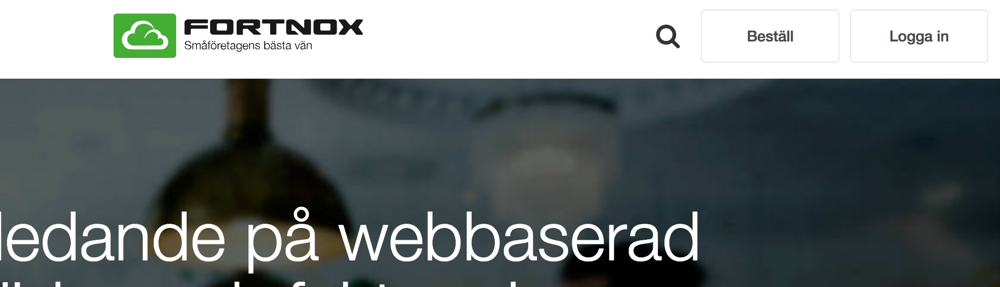
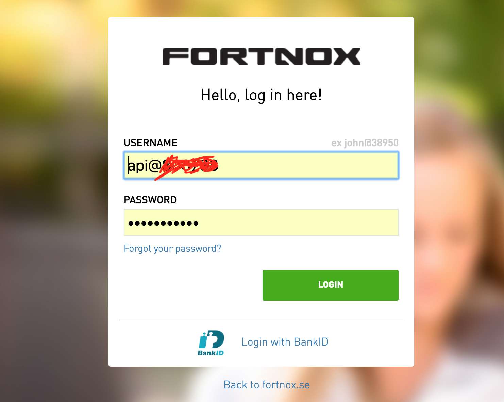
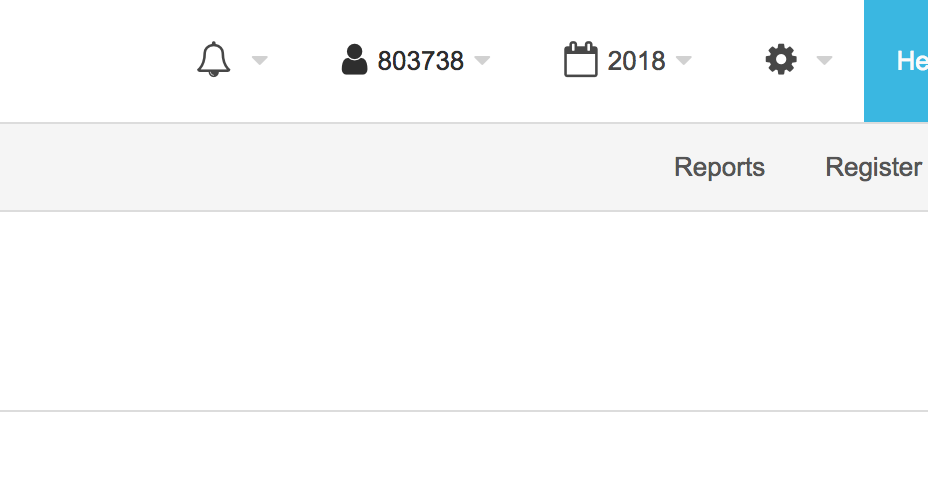
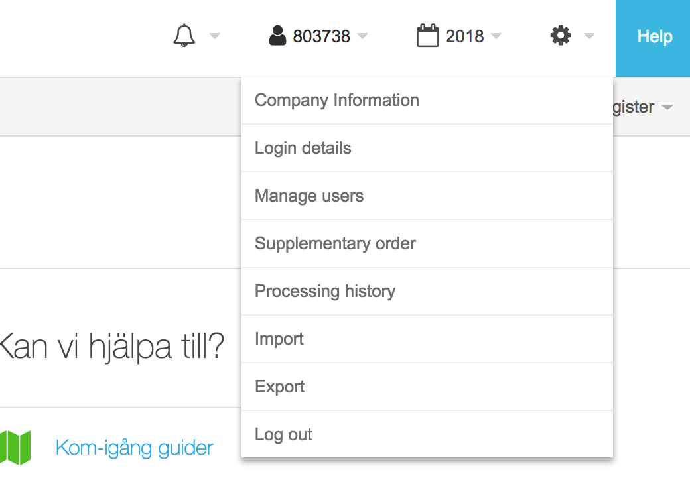
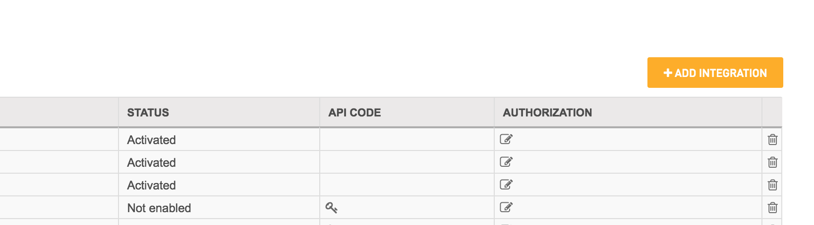
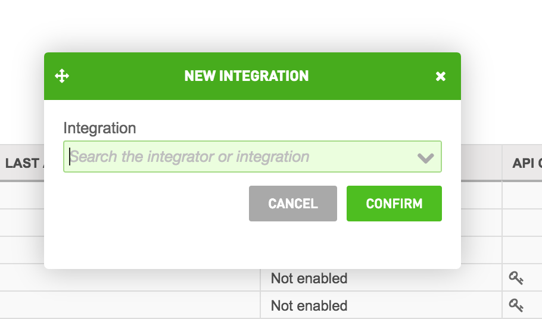
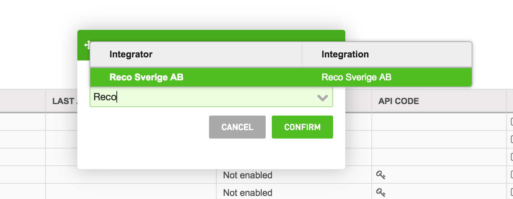
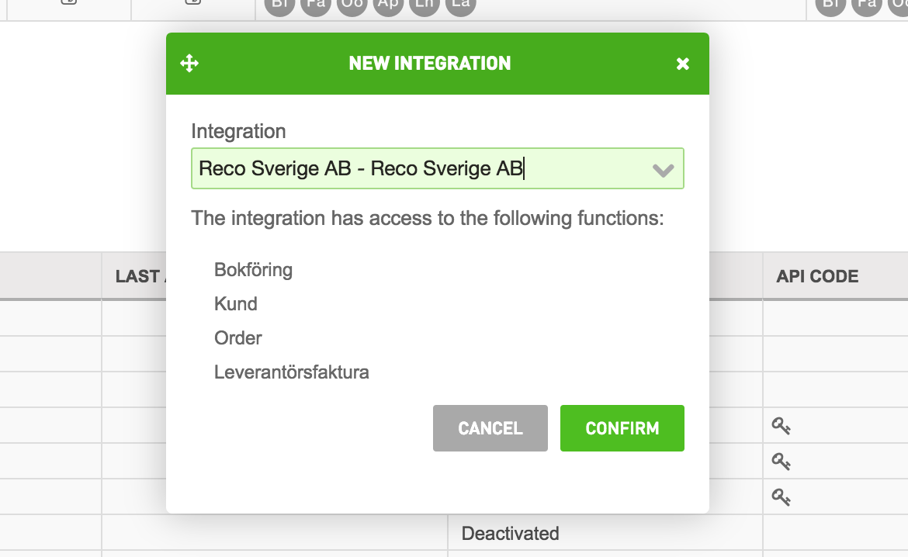
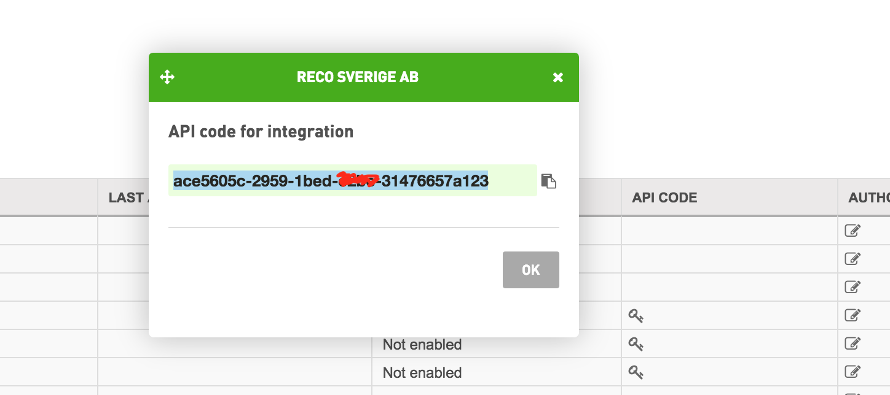

# Fortnox integration instructions

1. Go to [Fortnox Website](https://www.fortnox.se/)
2. Click 'Log in' to log in into Fortnox

3. Enter your username and password

4. Once logged in you will see a dropdown menu on the right hand side (top of the page) with some fortnox assigned number

5. Click the menu and select 'Manage Users'

6. When on the users page you can see on the right hand side the button 'Add Integration', click it.

7. Inside the modal box shown, enter the word 'Reco'. You should see a populated record for Reco Sverige AB integration.

Select it and click 'Confirm'.

8. A new modal box will be shown with the integration api key, copy and save it.

9. Send the api key to your sales representative at Reco

10. Done!

