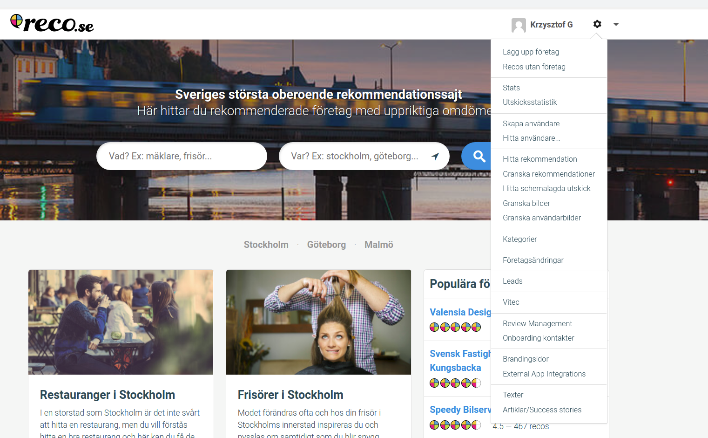
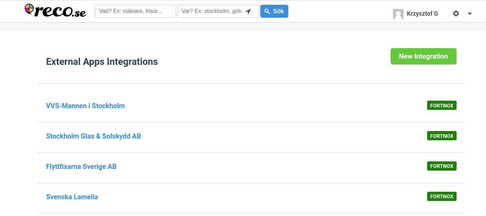
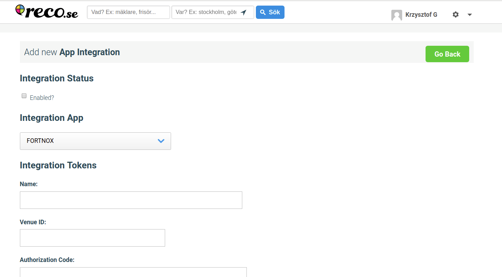
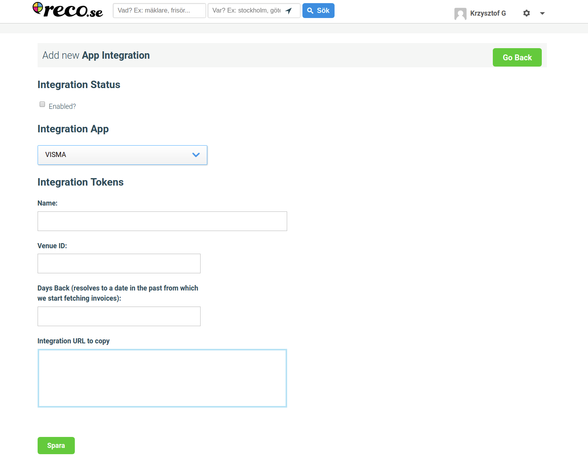
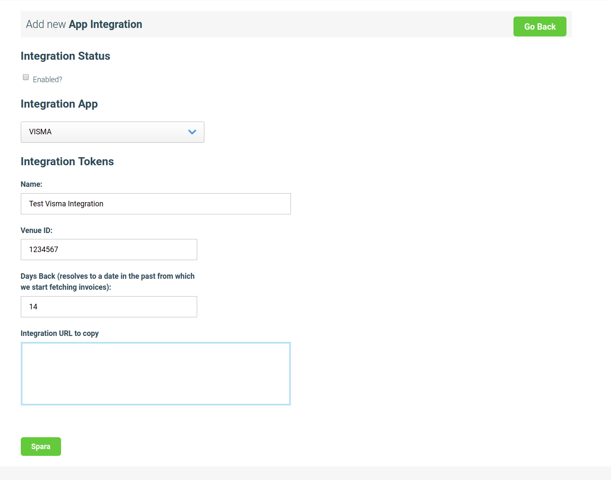
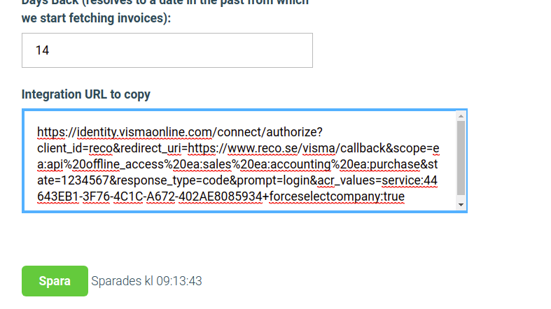
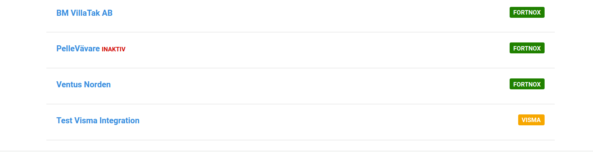
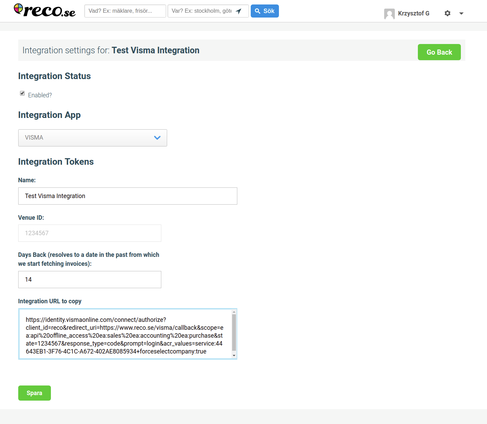
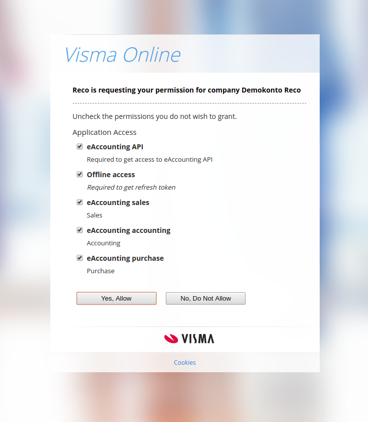
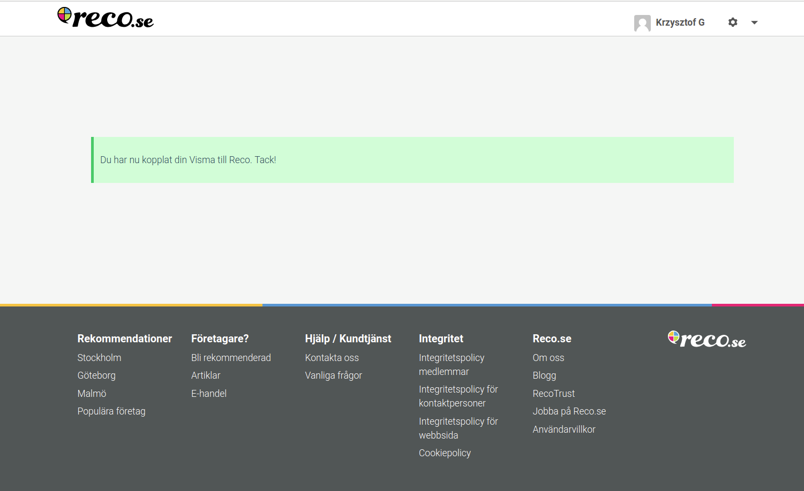

# Visma Integrations in Collector

From now on, its possible to add visma and fortnox integration using the same page as an administrator in reco.se.

## Starting Up the Integration on Reco side

1. To add new Visma integration, please go to 'Settings' -> 'External App Integrations'

2. The list of existing integrations will open. The label on the right shows the information for which
external system the integration was created.

3. To add new integration, select 'New Integration' button.

4. On the 'New Integration' page you need to select 'Visma' from the 'Integration App' dropdown to see the list 
of the fields needed for visma integration.

5. Once selected, the list of needed fileds will be reduced to simple name, venue_id for which you want to 
create an integration and the number of days for which you want to fetch the invoices from visma.
Eg. If you want to fetch invoices at least for the last week, enter 7 as a value for the 'Days Back' field.

6. Once the Name, VenueId, DaysBack fields are filled up, save the new integration. The URL to copy will be
generated for you. You can share that url with the user who will continue the integration process on their side.

7. On the list of integrations you will be able to see the newly added visma integration

## Integrating Visma Account with Reco

1. When the owner of the Visma account will receive the generated earlier URL. He/She can go to that
URL and start the process of integrating his/her visma account with reco.
After opening the URL the user will be propmted to log in to Visma (if not logged in already) and accept
the selected scopes needed for the integration

2. To enable integration the user needs to click 'Yes, Allow'.

3. Visma will redirect the user back to reco.se to see if the integration was added successfully

