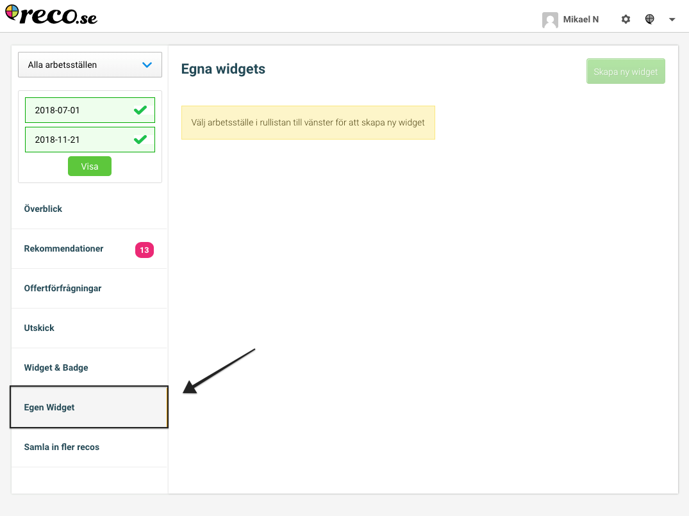
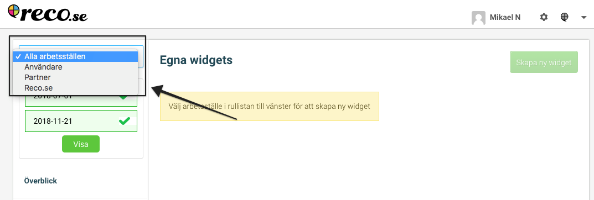
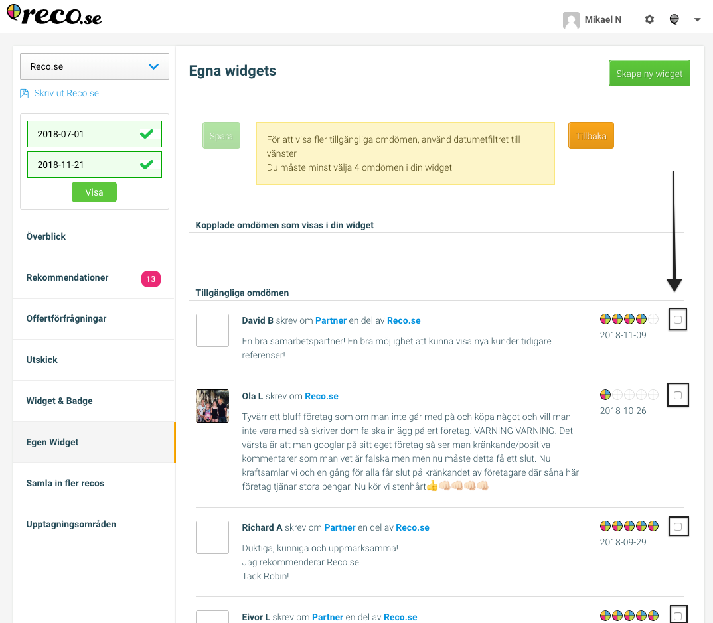
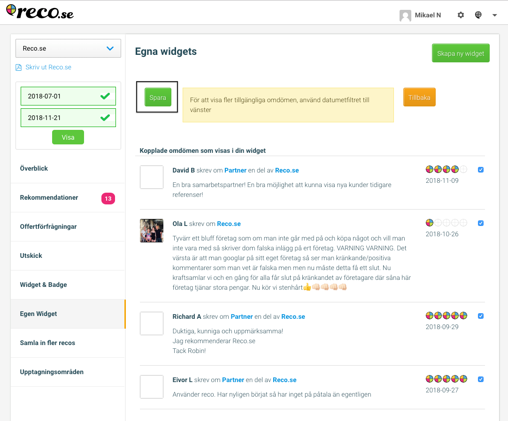
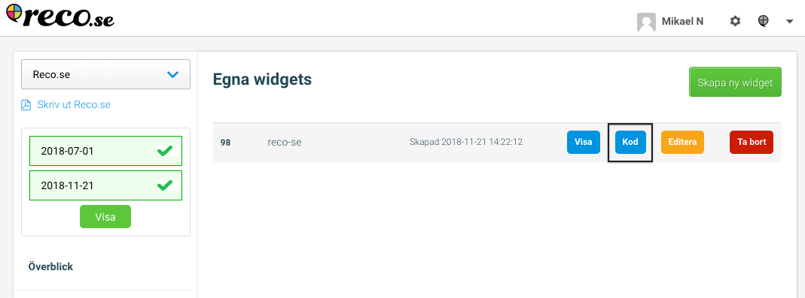
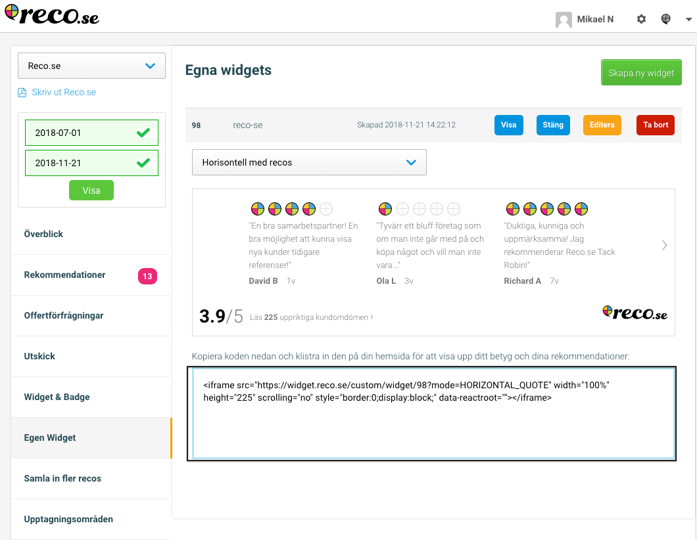
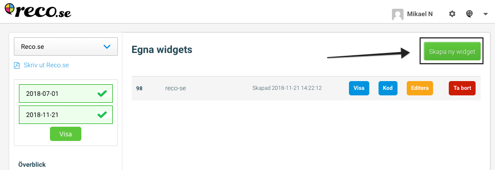

# Egen Widget intruktion

1. Logga in i företagskontot på [Reco] (https://www.reco.se/u/logga-in)
2. Klicka på egen widget i vänsternavigeringen

3. Välj arbetsställe uppe till vänster

4. Välj omdömen som du vill inkludera i widgeten

Tips! Om du inte ser några omdömen testa att välja en längre datumperiod uppe till vänster

5. Spara din widget genom att klicka på spara

6. För att kopiera koden till din widget så du kan lägga in den på siten klicka på kod

7. Kopiera koden i rutan

8. För att skapa fler widgets klicka på Skapa Ny

9. Gå igenom steg 3-7 igen. 